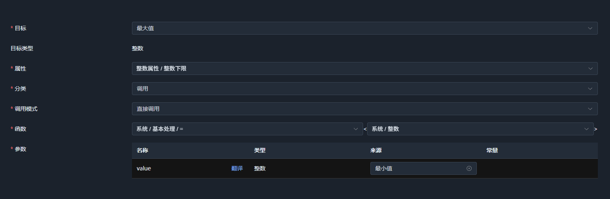
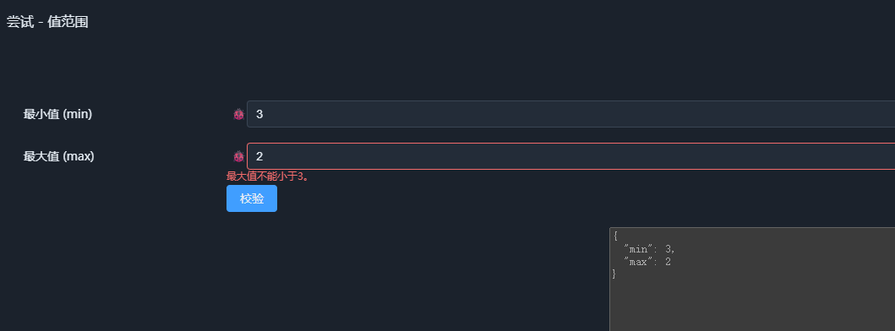

# 02. 如何构造多维语义空间

上一章讨论了一个问题：

> **为什么需要一个独立于代码的语义层？**

如果业务语义不应该长期隐藏在数据库、后端、接口和前端各处，那么下一步的问题就是：

> **语义究竟应该如何被结构化，才能成为一个可以组合、传播并执行的语义空间？**

SchemaNode 的答案不是重新设计一种描述所有业务的万能语言，而是从最基本的数据结构出发，逐步增加语义能力。

其基本过程可以概括为：

```text
结构
  ↓
Property
  ↓
Relation
  ↓
Function
  ↓
语义传播与组合
  ↓
多维语义空间
```

---

## 1. 从数据结构开始

任何结构化语义都需要一个基础。

传统的数据类型解决的是：

> **这个数据由什么结构构成？**

例如：

```text
string
number
boolean
struct
array
```

它们描述的是数据的表示形式和组织方式。

一个结构体可以进一步由多个字段组成：

```json
{
  "name": "string",
  "age": "number"
}
```

这种描述已经比原始数据本身包含更多信息。

但它仍然主要回答的是：

> 有哪些数据？

而不是：

> 这些数据意味着什么？

例如，一个 `number` 可以表示年龄、金额、温度、百分比或者坐标。

从数据结构本身，并不能知道这些数字应该如何被理解。

因此，**结构是语义实体的基础，但不是语义实体的全部。**

---

## 2. 从结构到语义属性

如果一个 `number` 还具有最小值、最大值、默认值、只读状态、显示精度等约束，那么这些信息显然已经超出了 `number` 本身。

例如：

```json
{
  "type": "number",
  "min": 0,
  "max": 100
}
```

这里的 `min` 和 `max` 并没有改变数据的基本结构。

它仍然是一个 `number`。

但它已经具有了新的语义。

这就是 **Property** 所解决的问题：

> **让一个结构化实体能够携带多个可以组合的语义属性。**

一个实体可以同时拥有：

```text
          ┌── display
          ├── validation
          ├── permission
number ───┼── default
          ├── source
          └── ...
```

这些属性并不是数据结构本身，而是附着在结构之上的不同语义维度。

因此，多维语义空间中的“多维”，首先并不是指有很多种数据类型，而是指：

> **同一个语义实体可以从多个相互独立的维度被描述。**

这也是从传统数据类型走向语义类型的第一步。

---


## 3. 让实体内部的语义发生关联

给一个实体增加 Property，可以让它携带更多语义。但如果这些属性彼此独立，它们仍然只是一些并列的定义。

考虑一个表示数值范围的结构体：

```json
{
  "min": 0,
  "max": 100
}
```

这里有两个字段，分别表示最小值和最大值。

我们可以为 min 设置一个数值下限，也可以为 max 设置一个数值上限。但如果希望 max 始终不小于 min，仅仅分别定义两个字段的约束还不够。

我们需要描述字段之间的语义关系。

例如，当 min 的值发生变化时，max 的有效范围也应该随之变化：

```text
struct: minMax
    │
    ├── min: number
    │
    └── max: number
          ↑
          │ lowlimit
          │
        min
```

这里，max 的 lowlimit 不再是一个固定值，而是由 min 提供。



通过 Relation，我们可以将这种依赖关系表达为结构化定义，而不必把它隐藏在某个函数的内部实现中。

当 min 的值发生变化时，相关语义便可以据此重新解释和执行。



这体现了 Relation 的一个基本作用：

Property 描述实体具有什么语义，Relation 则描述这些语义如何关联。

此时，关联发生在同一个结构体的字段之间。对于结构体类型来说，这个关联是内部语义，**这种语义类型不再是平面属性表，而是一个可追踪的局部语义空间。**

从这里开始，语义不再只是静态的描述，而具备了表达动态关联的能力。

---

## 4. 从关联到语义作用

前面的例子中，`min` 与 `max.lowlimit` 已经建立了语义关联。

但 Relation 本身并不负责完成具体的计算。

它描述的是：

> **哪个语义与哪个语义发生关联。**

而这种关联如何产生实际作用，则由Relation的种类来确定，上图采用了最常用的，基于 `Function` 来执行。

在 `minMax` 中，可以将语义关系理解为：

```text
min
 │
 │ Relation
 ↓
max.lowlimit
```

而 Relation 所关联的执行作用可以进一步表示为：

```text
min
 │
 │ Relation
 ↓
Function
 │
 ↓
max.lowlimit
```

当 `min` 的值发生变化时，Function 根据 Relation 提供的语义关系重新计算 `max.lowlimit`。

因此：

> **Relation 描述语义如何关联，Function 描述这种关联如何产生作用。**

Function 并不需要规定具体使用什么技术实现。

同一个语义函数，可以根据不同的执行目的被编译成不同的执行形式：

```text
                 语义函数
                    │
          ┌─────────┼─────────┐
          ↓         ↓         ↓
       SQL查询    C#代码    语义推理
```

执行方式可以不同，但它们表达的是同一个语义作用。

这使得语义定义不再只是静态描述，而开始具有可执行性。

---

## 5. 从局部语义到多维语义空间

`minMax` 这个例子看起来很简单，但它已经具备了一个完整语义实体的基本特征。

它首先具有结构：

```text
struct: minMax
├── min: number
└── max: number
```

然后，字段可以携带不同的 Property：

```text
min
 └── ...

max
 ├── lowlimit
 └── ...
```

实体可以通过Relation影响其它实体的 Property：

```text
min
 │
 │ Relation
 ↓
max.lowlimit
```

最终由 Function 产生具体的语义作用。

因此，这个结构体已经不再是一个简单的字段集合。

它形成了一个可以被追踪的**局部语义空间**：


这里的“多维”并不是指 `min`、`max`、Relation、Function 是四个平行的数据维度。

真正的多维性来自：

> **同一个结构化实体可以同时拥有多个可组合的语义 Property，而这些 Property 又可以通过 Relation 和 Function 形成动态的语义结构。**

因此，一个语义类型不再只是：

```text
字段 + 字段 + 字段
```

而是：

```text
结构
 + Property
 + Relation
 + Function
```

共同构成的语义实体。

---

## 6. 从局部语义空间到更大的语义空间

前面的 `minMax` 是一个很小的语义实体。

它本身由两个字段组成：

```text id="0qzj7g"
minMax
├── min
└── max
```

而 `min` 和 `max` 又各自具有自己的结构和语义。

因此，结构化语义并不是从一个庞大的实体开始定义，而是可以从一个个更小的语义实体开始，通过结构组合逐步形成更大的实体。

```text id="w3w2a8"
小实体
  ↓
结构组合
  ↓
更大实体
  ↓
继续组合
  ↓
复杂语义实体
```

例如：

```text id="lq4d9x"
        Entity A
       ┌────┴────┐
       ↓         ↓
    Entity B   Entity C
      │           │
      ├── P1      └── P2
      └── P2
```

这里的组合并不只是把几个字段放进一个结构体。

当一个实体被组合到更大的实体中时，上级实体还可以根据自身的语义，对下级实体增加新的 Relation。

例如：

```text id="3q0q5v"
             上级实体
            /        \
           /          \
       下级实体 A    下级实体 B
           │
           │ Relation
           ↓
       B.Property
```

因此，一个下级实体并不是一旦定义完成，就只能保持固定的语义。

它可以在不同的组合环境中，被上级实体赋予新的语义关联。

这使得语义实体具有一种重要的组合能力：

> **实体负责定义自身的语义，上级实体可以通过 Relation 进一步定义这些实体在当前语义环境中的作用。**

因此，同一个基础实体可以被复用到不同的上级实体中，而不同的上级实体又可以建立不同的语义关系。

这与传统的字段嵌套有本质区别。

传统结构组合主要解决：

> **数据如何组织。**

语义组合进一步解决：

> **组合之后，这些实体之间具有什么新的意义，以及这种意义如何发生作用。**

于是，语义空间可以不断向外扩展：

```text id="d1q6l9"
              问题域
                 │
        ┌────────┴────────┐
        ↓                 ↓
     大实体 A           大实体 B
      │   │              │
      │   └──Relation────┤
      │                  │
      ├── 小实体         ├── 小实体
      │                  │
      └── 小实体         └── 小实体
             │
          Property
             │
          Relation
             │
          Function
```

每一次结构组合，都可以产生新的语义关系；每一层实体又可以针对下一层实体建立新的 Relation。

因此，语义空间不是一张预先设计好的固定模型，而是一个可以通过**结构组合、Property 叠加、Relation 关联和 Function 执行**不断扩展的空间。

当这种组合不断深入，并最终覆盖一个完整的问题域时：

> **由这些相互关联、可以组合和执行的语义实体共同构成的整体，就是一个完整的多维语义实体空间。**

这里的“多维”也因此有了更完整的含义：

* **结构组合**让语义实体可以从小到大构成复杂实体；
* **Property**让每个实体拥有多个独立的语义维度；
* **Relation**让上级与下级、实体与实体之间产生动态语义关联；
* **Function**让这些关联能够产生确定的语义作用。

由于语义实体采用递归组合的层级结构，Relation 又受到明确的作用方向约束，因此这种不断扩展的语义空间并不是任意的关系网络，而是天然保持有向无环结构。

最终形成的并不是一棵单纯的数据结构树，也不是一张简单的关系图，而是一个可以随着实体组合不断扩展的**可执行语义空间**。


---

## 7. 语义空间不是静态描述，而是可以执行的

如果语义空间最终只是一个更加复杂的描述文件，那么它仍然只是另一种 Metadata。

SchemaNode 的关键区别在于：

> **语义定义与语义执行是两个不同的层次。**

语义描述的是：

```text
我要表达什么
```

执行层决定的是：

```text
我要如何执行它
```

因此，同一个语义可以被不同执行层解释：

```text
                结构化语义
                     │
                     ↓
                语义解析
                     │
              ┌──────┼──────┐
              ↓      ↓      ↓
             UI     SQL    Code
              │      │      │
              └──────┼──────┘
                     ↓
                   执行
```

例如，一个语义 Property 可以：

* 在前端表现为输入控件的约束；
* 在后端表现为数据验证；
* 在数据库查询中表现为过滤条件；
* 在其他执行层中表现为推理条件。

这些执行方式可以完全不同。

但它们解释的是同一个语义。

因此，SchemaNode 并不试图规定所有执行层应该采用什么技术，而是把：

> **语义是什么**

与：

> **语义如何执行**

分离开来。

这也意味着，语义定义本身可以保持稳定，而执行层可以独立演进。

---

## 8. 语义方言：让不同领域表达自己的语义

如果所有领域都使用完全相同的语义定义，自然会遇到另一个问题：

> **不同领域的语义显然并不相同。**

权限系统需要权限语义。

数据处理系统需要 ETL 语义。

工作流需要状态与事件语义。

医疗、金融、工业等领域也会有自己的专业语义。

因此，SchemaNode 并不试图建立一个包含所有领域概念的万能业务语言。

相反，它允许在公共语义基础之上形成不同的**语义方言（Semantic Dialect）**。

语义方言也可以理解为一种 **Schema DSL**：

```text
公共语义基础
      │
      ├── App 方言
      ├── Workflow 方言
      ├── 数据处理方言
      └── 领域方言
```

一个方言定义的是：

* 这个领域有哪些语义实体；
* 这些实体可以具有哪些属性；
* 可以建立哪些关系；
* 可以使用哪些函数；
* 这些语义如何投影到对应的执行层。

因此，领域扩展并不是不断向核心增加特殊业务代码，而是在公共语义基础上增加新的语义定义能力。

---

## 9. DSL 本身也是结构化语义

如果一个 Schema DSL 用来描述：

```text
实体
属性
关系
函数
```

那么 DSL 本身描述的也是结构化数据。

例如：

```text
Schema DSL
   │
   ↓
定义一个语义类型
   │
   ↓
语义类型本身也是 Schema
```

这意味着：

> **描述语义的语言，本身也可以成为被描述的语义。**

于是，系统开始出现自举的可能：

```text
语义
 ↓
Schema
 ↓
定义 Schema 的 Schema
 ↓
更高层的语义定义
```

这不是为了制造一套复杂的元编程体系，而是因为：

> 如果语义本身已经被结构化，那么描述语义的工具也不应该再依赖一套完全不同的、隐藏在代码中的描述机制。

SchemaNode 后续的自举能力，正是从这里开始。

---

## 10. 公共语义基础

当不同语义方言都建立在相同的基础能力之上时，又会产生一个重要价值：

> **不同语义之间开始具备共同的理解基础。**

例如，无论一个领域定义什么业务实体，都需要某种方式表达：

```text
类型
属性
关系
函数
约束
```

这些并不属于某一个具体业务领域，而属于：

> **“如何定义和处理结构化语义”本身。**

因此，公共语义共识并不是试图规定：

> 所有行业必须使用同一套业务模型。

而是规定：

> **不同语义方言至少应该能够使用共同的基础结构来定义、携带、交换和理解语义。**

这为不同执行层、不同领域以及不同语义方言之间的兼容提供了基础。

---

## 11. 从描述数据到描述意义

到这里，可以重新看待传统的数据模型。

传统的数据类型：

```text
string
number
boolean
struct
array
```

解决的是数据结构。

在它之上增加 Property，可以表达：

```text
约束
显示
权限
默认值
状态
来源
...
```

再通过 Relation 和 Function：

```text
实体
 ↓
语义属性
 ↓
语义关系
 ↓
语义作用
 ↓
语义传播
```

于是，数据开始从：

> **“是什么结构”**

逐渐变成：

> **“具有什么意义，以及这种意义如何与其他意义发生作用”。**

这也是从**数据类型**走向**语义类型**，最终走向**多维语义空间**的过程。

---

## 12. 从语义空间走向语义语言

到这里，我们已经可以看到一条完整的构造路径：

```text
数据
 ↓
结构
 ↓
Property
 ↓
Relation
 ↓
Function
 ↓
局部语义空间
 ↓
更大的语义空间
 ↓
语义方言
 ↓
公共语义基础
```

如果这些能力可以不断组合，那么下一个问题自然出现：

> **构成这种语义空间的最小元素是什么？**

SchemaNode 将其进一步归纳为四种基础语义原语：

> **Meta、Property、Relation、Function。**

它们并不是四种业务对象，而是构造**可执行结构化语义**的基本能力。

下一章将从 SchemaNode 的实际定义机制出发，说明这四种原语分别承担什么作用，以及它们如何共同构成语义定义域。

---
