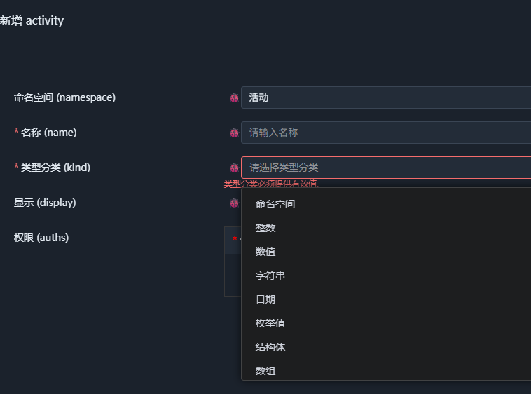
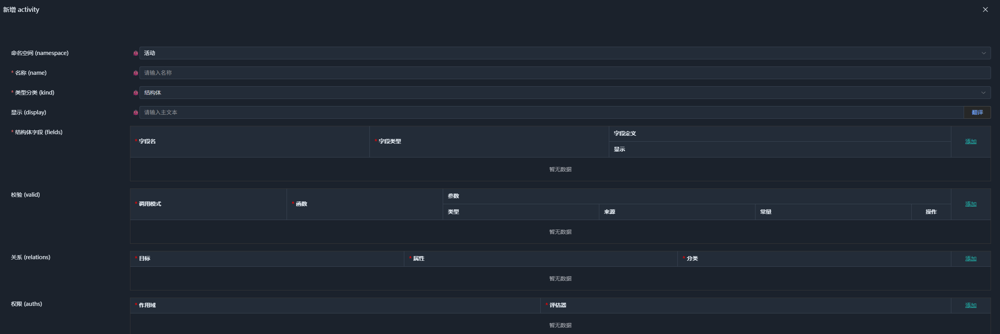
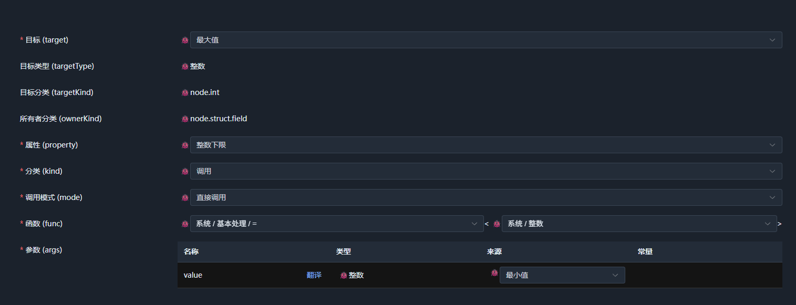
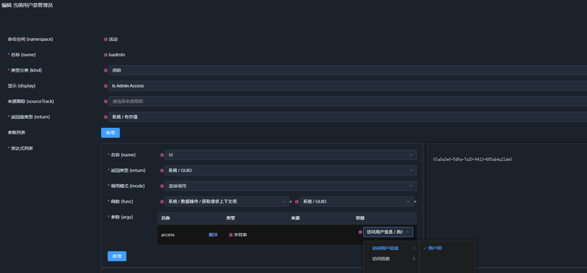

# 04. 定义域和公共语义共识

前三章从代码与语义的关系出发，逐步构造了多维语义空间，并由 Meta、Property、Relation、Function 四种语义原语构成了语义实体。

随后，我们进一步引入**原型（Prototype）**，使语义类型获得了稳定的结构和能力边界，并建立了语义与执行层之间的最小契约。

到这里，理论上的推演已经完成。

如前所述，我们无法为所有业务领域定义一组统一的语义原型，但我们可以围绕**原型的定义域**来构建一个**公共语义共识**。

---

## 1. 定义域

定义域是解决“如何在语义空间中定义实体”这一问题的工程领域。按照之前的讨论，它可以分为三个阶段：

1. 如何定义语义原型，以及如何管理语义原型。
2. 如何从语义原型定义语义类型，并对语义类型进行管理。
3. 如何从语义类型构造语义实体。

定义域需要覆盖未知领域的语义原型定义——这是它区别于固定业务模型的关键。

如果定义域只能定义预先确定的几种实体，那么它本质上仍然是一个固定模型，而不是语义语言的定义基础。

另一方面，能够被不同执行层解析和执行的语义，其中间形式必然是结构化数据。因此，**定义域**本身必须覆盖**数据处理领域**。

同时，作为构成语义的基本元素，Property、Relation、Function 也必须能够在定义域中被定义、组合和处理。这意味着定义域不能只是一个“描述工具”，它自身也必须能够被同一套语义机制描述。

因此，定义域最终需要完成自身的自举：

```text
定义原型
    ↓
定义语义类型
    ↓
定义语义实体
    ↓
定义 Property / Relation / Function
    ↓
定义语义本身的处理方式
    ↓
继续定义新的原型与类型
```

这也是定义域与普通元数据系统之间的重要区别。

它不只是描述业务数据，而是描述**如何描述数据本身**。

---

## 2. 语义原型

### 2.1 原型标识符

语义原型用于对实体进行分类，同时也是执行层确定如何解释和执行语义的关键。

执行层需要知道一个实体属于哪个原型，才能确定它对应的 Meta、可以挂载哪些 Property，以及如何加载和处理由该原型定义的语义类型。

因此，无论语义空间还是执行层，都必须对原型存在明确的认知。

原型本身并不需要携带复杂的抽象描述。只要能够唯一标识一个原型，使语义空间和执行层能够对它形成共同认知即可。为了跨语言和跨平台兼容，我们采用唯一的字符串标识来代表原型。

例如，上一章中出现的 struct、enum、array 等，首先是节点的分类（Node Kind）；对应的具体原型则由定义域建立。例如在 SchemaNode Core 中，结构体对应的原型是 node.struct。

直接将 struct、enum、array 作为顶层原型，会使不同定义域之间容易产生命名冲突，因此需要进一步引入原型族。

---

### 2.2 原型族

在前面讨论的语义方言中，每种方言都可能定义自己的原型。为了避免不同方言之间产生命名冲突，原型标识符需要具有明确的作用域。

因此，可以类似命名空间一样，为每个定义域或语义方言建立一个顶层原型分类，再在其下定义具体原型，从而形成一个**原型族**。

SchemaNode Core 当前采用 `node` 作为顶层原型名：

```text
node
├── scalar
├── int
├── enum
├── array
├── struct
│   └── field
├── function
│   └── arg
└── ...
```

对应的完整标识符可以表示为：

```text
node.struct
node.enum
node.array
node.struct.field
node.function
node.function.arg
```

这里的 node 是 SchemaNode Core 公共定义域选择的顶层原型，node.struct 则是 node 原型族中用于描述结构体节点的具体原型。

需要注意的是，struct 本身是 Node Kind，而 node.struct 才是对应的 Node Prototype。这样的区分使节点的分类与原型的定义保持独立，也避免将某一种定义域的具体实现直接固化到语义声明中。

语义声明虽然依赖原型提供的 Meta 和 Property 进行解释，但语义声明本身通常并不需要携带所属原型的完整描述。

这意味着，语义声明与具体原型实现之间可以保持相对独立：

```text
语义声明
    │
    ├── Meta
    └── Property
          │
          ↓
      原型解释
```

因此，SchemaNode Core 选择 `node` 作为中性的顶层原型名，也为未来留下了替换空间。

如果将来出现一套更完善、但仍然兼容 `node` 公共语义的定义域实现，那么原有语义声明理论上可以直接由新的原型体系解释，而不需要在语义数据中修改大量与具体实现相关的信息。

这也是公共语义共识与具体定义域实现之间应当保持的边界。

---

### 2.3 如何设计原型

当我们对语义实体进行分类时，就是在定义原型。

原型并不是对某种数据的简单命名，而是规定了这种实体具有什么确定的结构，以及能够承载哪些语义属性。

例如，一个函数参数除了具有名称和类型之外，还可能具有 `Require`、`Variadic` 等语义。

以函数：

```text
add(1, 2, 3, 4)
```

为例，它的语义声明可以类似：

```jsonc
{
  "name": "add",
  "args": [
    {
      "name": "values",
      "type": "int",
      "variadic": true
    }
  ]
}
```

对于 `node.function.arg` 来说：

```text
Meta
├── name
└── type

Property
└── variadic
```

其中，`name` 和 `type` 是参数结构中确定存在的 Meta，而 `variadic` 是可选的语义 Property。

`variadic` 本身并没有特殊的数据表示。它之所以能够被理解，是因为 `node.function.arg` 原型定义了 `Variadic` Property，执行层因此知道这个属性代表参数是否为可变参数。

这也是原型存在的意义：

> **原型不是携带语义，而是规定一组语义如何被解释。**

一个数据值只有在被放入确定的语义结构中之后，原本没有特殊意义的数据字段才会获得明确的语义。

因此，设计原型时需要考虑的不是“业务上有哪些对象”，而是：

> **某类语义实体需要具有什么确定的结构，以及它需要允许哪些可组合的语义扩展？**

---

## 3. 语义类型

原型解决的是“如何定义一类语义实体”，语义类型则是在原型基础上进一步形成可以被复用的具体语义定义。

例如：

```text
Prototype
    ↓
node.int
    ↓
   int
    ↓
   age
    ├── unit: '岁'
    └── lowlimit: 0
```

`node.int` 规定整数节点具有怎样的结构和能力；`age` 则是在这个基础上定义出来的一个具体语义类型。

语义类型本身仍然是结构化语义数据，因此它可以继续被组合、继承或扩展，并最终用于构造实际语义实体。


### 3.1 语义类型的执行层承载

从本节开始，我会使用 SchemaNode Core 实现的执行层来展示语义类型的定义与管理。因为这部分是代码层面的语义申明，相比解说要更容易理解，但请注意，这只是 SchemaNode 在对多维语义空间的探索中构建的一种实现。

SchemaNode Core 申明的`node` 原型，用于实现类型的定义与管理。它提供类型的命名空间管理，它关注于类型的组织而非具体的功能。它的申明代码如下：

```C#
// 申明 node 原型，并主动将 Display 属性注册到原型中
[Meta<SchemaKind>("node")]
[Meta<Append>(typeof(Display))]
public sealed class NodeKind;

// 申明 node 原型使用的 Meta，因为它是结构体类型，采用SchemaType注册为结构体语义类型
// 注意原型本身并不需要知道这个结构体，而是这个结构体类型通过 Attach 属性指明采用 node 原型，即它可以保存 node 的所有语义属性
[Meta<SchemaType>("system.schema.node.schema")]
[Meta<Attach>("node")]
public sealed class NodeSchema: PropertyOwner
{
    // 命名空间，通过 SchemaType 进一步限定它使用的语义类型
    [Meta<SchemaType>(typeof(NamespaceType))]
    public string? Namespace { get; set; }
    
    // 类型名称，Identifier限定它的正则表达式为字母、数字或下划线
    [Meta<SchemaType>(typeof(Identifier))]
    public string Name { get; set; } = null!;
        
    // 数据类型分类，稍后解释
    [Meta<SchemaType>(typeof(NodeKind))]
    public string Kind { get; set; } = null!;
}
```

这样，在配置UI上，只需要一行视图 `<schema-view v-model="nodeSchema" type='system.schema.node.schema' />` 即可生成语义类型的配置界面，而无需预先知道可用的数据类型以及这些类型的实际结构和属性。



图中 Display 是定义`node`原型时主动注册的，而 Auths 则是App领域方言为 `node` 原型注册的，用于提供权限管理。

上述代码采用**代码即Schema**的设计模式，确保执行层代码和申明在一起定义，无需额外的对齐和注册机制。这里的“代码即 Schema”，并不是说语义只能通过代码定义，而是指 SchemaNode Core 的执行层可以直接使用代码声明自身所支持的语义结构，从而避免另外维护一套与执行代码对应的 Schema。

### 3.2 命名空间语义类型

虽然 `node` 本身具有 `namespace` 和 `name` 字段，但它本身不算是语义类型，它只是为了类型通用管理提供的结构，它的语义基于 `kind` 字段提供，首先我们需要引入真正的命名空间语义类型。

```C#
[Meta<SchemaKind>("node.namespace")] // 申明 `node.namespace` 原型
[Meta<NodeKind>("namespace")]  // 向 `NodeKind` 申明一个 `namespace` 语义类型分类
[Meta<NodeType>(typeof(RuntimeNamespaceType))] //申明 `namespace` 类型的执行层实现
public sealed class NamespaceKind;
```

注意 `NodeSchema` 中 `kind` 的语义类型对应`NodeKind`，它是一个枚举类型，可以收集所有使用`Meta<NodeKind>(kind)` 注册的语义类型分类。这也是上图中 `kind` 输入框选择项目的由来。

命名空间表明它只是用于类型组织，所以不具有具体的功能，也没有进一步的设置。

---

### 3.3 数据类型

以 `struct` 为例，说明下数据语义类型的定义规则，也实质展示四原语如何完成语义的表达。

```C#
[Meta<SchemaKind>("node.struct")] // 声明 `node.struct` 原型
[Meta<NodeKind>("struct")] // 向 `NodeKind` 申明一个 `struct` 语义类型分类
[Meta<NodeType>(typeof(RuntimeStructType))] // 申明 `struct` 类型的执行层实现
[Meta<SchemaGenerator>(typeof(StructGenerator))] // 申明 `struct` 类型的生成器，基于反射从C#代码生成语义结构体类型
[Meta<Append>(typeof(Generics), typeof(Relations))] // 申明 `struct` 原型具有泛型和关系属性
public sealed class StructKind;

// 申明 `struct` 类型的 Meta 定义结构体
[Meta<SchemaType>($"system.schema.struct.schema")]
[Meta<Attach>("struct")]  // 为这个结构体指明采用 struct 原型，即它可以保存 struct 的所有语义属性
public sealed class StructSchema : PropertyOwner
{
    // 结构体字段
    public StructFieldSchema[] Fields { get; set; } = [];
}

// 为`node`原型定义 `struct` 属性，基于类型名生成`struct`属性，挂载到`node`原型上
[Meta<ForSchema>("node")]  // 表示这个 Property 服务于 node 原型——它回答的是“我在哪个原型上挂载”
[Meta<OfNodeKind>("property")] // 表示这个 class 被解析为 node 下的 property 语义类型分类——它回答的是“我是什么语义类型”
[Meta<SchemaType>("system.schema.prop.struct.struct")] // 申明该属性注册的语义类型名称
[Relation<Visible, Relation.Call>("struct", "system.logic.eq", $"@{nameof(NodeSchema.Kind)}", "struct")]
public sealed class StructProperty : Property<StructSchema>

// 申明 `node.struct.field` 原型
[Meta<SchemaKind>("node.struct.field")]
[Meta<Append>(typeof(Disable), typeof(Display), typeof(Visible), typeof(Require))] // 省略更多
public sealed class StructFieldKind;

// 申明 `node.struct.field` 原型的 Meta 定义结构体
[Meta<SchemaType>("system.schema.struct.field.schema")]
[Meta<Attach>("node.struct.field")]
public sealed class StructFieldSchema : PropertyOwner
{
    // The field name
    [Meta<SchemaType>(typeof(Identifier))]
    public string Name { get; set; } = string.Empty;
    
    // The type name of the node.
    [Meta<SchemaType>(typeof(ValueType))]
    public string Type { get; set; } = string.Empty;
}
```

这里最特殊的是`StructProperty`属性定义，它以 StructSchema 为值类型，然后挂载到 `node` 原型上,并且它申明了可见性关联。

```C#
[Relation<Visible, Relation.Call>("struct", "system.logic.eq", $"@{nameof(NodeSchema.Kind)}", "struct")]
```

它对应于关联描述:

```jsonc
{
    target: "struct", // 目标是struct属性自身
    property: "visible",  // 关联的是visible属性
    call: "system.logic.eq", // 执行采用函数调用，函数是相等判定
    args: [
        { source: "kind" },  // 挂载 `node` 原型附着的结构体上存在 `kind` 字段
        { value: "struct" }  // 实际意思就是当 `kind` 选择结构体时，`struct` 可见
    ]
}
```



这张图中选择`kind`为结构体后，下面的结构体字段(fields), 关系(Relation)等属于`struct`原型的字段和属性才变得可见。

上述结构体的定义相对传统编程，而将`struct`的显示判定从前端代码转移到了关联描述中就是定义了它的部分语义，完成这一步后，前端配置UI变成了执行层，而无需依赖特殊代码实现对`struct`的支持。

类似这种形式，SchemaNode Core 提供了 `bool`, `int`, `decimal`, `string`, `date`, `enum`, `struct`, `array`这些结构化数据类型。这些在 `core` 的文档中进一步介绍。

下面是一个简单的结构体示例:

```jsonc
{
  "namespace": "test",
  "name": "minmax",
  "kind": "struct",
  "struct": {
    "fields": [
        {
          "name": "min",
          "type": "system.int",
          "display": "最小值"
        },
        {
          "name": "max",
          "type": "system.int",
          "display": "最大值"
        }
    ],
    "relations": [
      {
        // 将 min 赋值给 max.lowlimit
        "call": {
            "args": [
                {
                    "type": "system.int",
                    "source": "min"
                }
            ],
            "func": "system.intrinsic.assign<system.int>", // 赋值函数
            "mode": "call"
        },
        "kind": "call", // 关联执行类型，采用函数调用
        "target": "max",
        "property": "lowlimit", // 下限
      }
    ]
  }
}
```

这里也可以看到，实际的语义申明中并没有`node`相关的特殊标识，或者特殊`system.schema.struct.schema`这样的类型。而`property: "lowlimit"` 只表达“目标实体具有一个名为 lowlimit 的语义属性”，至于这个属性由哪个 Property 解释，则由当前定义域根据目标实体所属的原型进行解析。

`system.schema`下的类型都是定义相关的，而类似 `system.intrinsic.assign`这样的语义函数则是公共语义的组成部分，定义相关类型在不同的定义域实现中可以不同，但公共语义类型则需要被所有执行层实现。


---

### 3.4 属性类型

Property 是构成多维语义空间的重要原语。它申明自己支持的原型，用于描述语义实体的属性。以上面使用的 `lowlimit` 为例：

```C#
[Meta<Alias>("lowlimit")] // 当类型名不能直接作为属性名时，用 Alias 申明属性名
[Meta<ForSchema>("node.int", "node.int.define", "node.int.usage")]
[Meta<OfNodeKind>("property")]
[Meta<SchemaType>("system.schema.prop.int.lowlimit")]
public class LowLimitInt : Property<long>, IConstraintProperty
{
    public bool? ValidateInt(SchemaContext context, IntNode node)
    {
        if (!HasValue || node.IsEmpty) return null;
        return node.GetValue<long>() >= Value;
    }
}
```

* 属性存在同名，这里定义的是`int`类型的下限属性。基于原型进行区分，在上面的关联中，`max`的类型`system.int`的原型是`node.int`，所以可以确保关联使用`system.schema.prop.int.lowlimit`属性，而不是`system.schema.prop.string.lowlimit`。
* SchemaNode Core 中还存在针对定义和使用场景的原型变体，它们最终仍归属于 node.int 的公共语义能力。具体机制属于 Core 实现细节，此处不再展开。
* 有一大类属性是约束属性，它们用于描述语义实体的约束条件，例如`lowlimit`属性，用于完成对`int`数据节点的校验，所有数据节点违反的约束都会被记录作为错误信息。
* 在执行层间传递的语义实体，只含有`lowlimit`而非具体的属性类型，所以，不同的执行层可以采用不同机制定义的属性完成语义的消费。这也是之前提到 SchemaNode Core 是可以被替换的，只要实现了公共语义共识。


---

### 3.5 Relation

在`test.minmax`中, `min`和`max`是两个语义实体，通过`test.minmax`为它们定义了关联关系。而更大的基于`test.minmax`类型构建的复杂结构化类型，可以为它下属的其他语义实体定义关联关系。

例如 App 方言中每个 App Field 对应一个数据库表，而 App 可以为多个 App Field 定义关联关系。综合来说，通过这种树状的，由祖先为后代的关联关系，可以实现稳定的有向无环图。

Relation 的代码申明为:

```C#
[Meta<SchemaKind>("node.relation")]
[Meta<SchemaType>("system.schema.relation.schema")]
[Meta<Attach>("node.relation")]
public class RelationSchema : PropertyOwner
{    
    // 关联的目标语义实体
    public string Target { get; set; } = null!;

    // 关联的属性名
    public string Property { get; set; } = null!;
    
    // 关联类型
    [Meta<SchemaType>(typeof(RelationKind))]
    public string Kind { get; set; } = null!;
}

[Meta<OfNodeKind>("property")]
[Meta<SchemaType>("system.schema.prop.core.relations")]
public class Relations : Property<RelationSchema[]>;
```

这里的 RelationSchema 并不是一个业务语义类型，而是用于描述 Relations 属性值结构的定义类型。
这样，任何需要它的地方都可以主动申明具有 Relations 属性，例如`node.struct`原型申明了结构体类型具有 Relations 属性。
关联类型类似于 `node` 的 `kind`，允许外界注册自定义关联执行类型， SchemaNode Core 提供 `assign`, `call`, `any` 三种关联执行类型，在`test.minmax`的例子中看到的是 `call` 关联执行的使用。

关联更多在UI配置界面中进行配置，例如在`test.minmax`中，`min`和`max`的关联关系如下：



属性和关联构成了语义实体的完整定义，而它们的实现依赖语义函数。

---

### 3.6 函数类型

语义函数包含两部分:

1. 原子语义函数，例如 `system.intrinsic.assign`。它有两个来源

    * 一种是公共语义共识定义的，需要各个执行层实现（当然实际上是执行层实现注册到语义空间中），例如 `system.intrinsic.assign`。
    * 另一种是执行层自行注册的，如果为了过渡，将旧微服务的处理注册到语义空间中，同样也可以被调用。
    
    但不管怎样，它们的注册方式都是一致的:

    ```C#
    [Meta<SchemaType>("system.intrinsic")]
    public static class SystemIntrinsic
    {
        // 定义了 system.intrinsic.assign 辅助函数
        public static T? assign<T>(T? value) => value;
    }
    ```

2. 自定义语义函数，通过UI配置界面进行定义，申明参数，返回值，和执行用的表达式，例如：

    

    > 它设计是基于纯函数式编程的，即函数的输入和输出都是确定的，没有副作用。


普通函数中，除了参数和返回值，对外不含有任何信息，很多特定的限制只能通过 `assert` 之类机制在内部进行判定，这种隐含的约定造成函数自身的语义是不完整的。

语义函数的语义由两处提供:

1. 函数参数的语义
    
    除了 `node.function` 原型外，`node.function.arg` 是为函数参数定义的原型，它不仅仅可以通过属性对参数进行描述，同时支持为参数配置关联，类似于结构体为它的字段申明关联。

    当函数调用时，这些关联会应用在调用参数上，例如上图中，使用`获取请求上下文`这个语义函数，它的参数提供的是级联选择，而非直接输入。这点不是UI提供的支持，而是该语义函数自身携带的。

    下面以 getcontext 为例，展示函数参数如何通过 Property 和 Relation 获得完整的语义描述。具体的机制将在 Core 文档中展开。
    通过这种机制可以实现相当复杂的参数选择，这时可以说这个语义函数是语义完备的，因为它原本内置的约定已经暴露给调用者。

    ```C#
    [Meta<SchemaType>("system.data")]
    public static class SystemData
    {
        // 获取请求上下文
        // 这个关联为access参数配置一个级联选择的消费器，既级联选择的内容对应的类型必须满足函数调用时的返回值类型
        [Relation<AccessEntryConsumer, Assign>($"{nameof(access)}.{nameof(CallArg.Value)}", $"{NS_SYSTEM_SCHEMA_REFLECT_TYPE}.{nameof(Reflect.Type.isassignableto)}", NODE_SELF, false, $"@{FUNC_RETURN}")]
        public static T? getcontext<T>(
            // C# 执行上下文，注册为语义函数时自动忽略
            SchemaContext context,
            
            // EntrySource 为 access 参数提供级联数据源
            [Meta<EntrySource>($"{NS_SYSTEM_SCHEMA_REFLECT_TYPE}.{nameof(Reflect.Type.getaccessentries)}", NS_SYSTEM_CONTEXT, NODE_SELF)]

            // AccessValueTypeProvider 将级联选择的值类似 `user.id` 转换为实际的数据类型
            [Meta<AccessValueTypeProvider>($"{NS_SYSTEM_SCHEMA_REFLECT_TYPE}.{nameof(Reflect.Type.getaccessvaluetype)}", NS_SYSTEM_CONTEXT, NODE_SELF)]
            string access)
        {
            IValueAccess? item = context.GetContextItem(access);
            return item != null ? item.GetValue<T>() : default(T?);
        }
    }
    ```

2. 数据化的语义表达式

    基于这种形式定义的语义函数表达式，是纯数据化的，并且没有临时变量，没有控制结构，是基于纯函数式编程的，它在编译时很容易转换为AST语法树，从而被执行层理解，修改，编译和执行。

    它是可推理的，例如 App 应用时可以基于 ETL 数据转换函数直接定位数据血缘关系，进而自动完成原本依赖人力需要反复实现的功能。

---

### 3.7 定义域

基于上述的命名空间、数据类型、Property、Relation 和 Function，我们构建了一个完整的语义定义域。而这些用于定义语义的原型和类型本身，也由同一个定义域完成定义。

SchemaNode Core 只是提供了一套基于 node 原型族的定义域实现。定义域与由它定义出的语义声明并不是强耦合关系，定义域可以独立于语义声明进行替换、扩展和迭代。

这与前面讨论的语义与执行分离是一致的：语义声明可以保持稳定，而解释和执行这些语义的定义域与执行层可以独立发展。

---

## 4. 公共语义共识

定义域解决的是如何定义和处理语义，而公共语义共识解决的是：

不同语义执行层之间，哪些定义能力必须能够被共同理解。

这种共识并不要求不同定义域采用完全相同的内部实现，甚至不要求原型名称完全一致。例如 SchemaNode Core 使用 node.int，另一种实现可以使用 atom.int。

真正需要保持一致的，是原型所表达的 Meta、Property 以及它们之间的语义约束。不同实现可以通过各自的原型体系完成映射，但最终需要能够对同一公共语义形成一致的解释。

因此，公共语义共识至少需要覆盖三个层次：

1. 公共原型能力
    需要能够表达基本的语义实体分类。例如结构体、数组、基本数据类型等。具体原型名称可以不同，但所表达的语义能力必须能够对应。

2. 原型的 Meta 与 Property
    例如，表示结构体的原型必须能够表达类似 fields: {name: string, type: string}[] 的结构，并能够承载其必要的语义属性。

3. 公共语义类型与函数
    基于上述定义域构造出的语义类型，以及诸如 system.intrinsic.assign 这样的公共语义函数，需要具有跨执行层可理解的语义。

system.schema 下的类型属于当前定义域的实现，而 system.intrinsic.assign 这类语义函数则属于公共语义的一部分。前者可以随着定义域实现而变化，后者则需要由不同执行层提供对应的实现。

因此，公共语义共识并不是规定一套固定的 SchemaNode 内部实现，而是规定不同执行层之间必须共同理解的最小语义能力。

---

## 5. 尚未解决的问题：Prototype 与协议

当前实现中，Prototype 负责确定语义定义，而执行层 API 负责提供这些语义定义的获取与执行入口。

Prototype 与 API 之间存在明确的对应关系，但这种对应关系目前仍然由执行层管理，并没有成为 Prototype 本身的一部分。

这是有意保留的边界。

如果未来语义需要跨执行层、跨系统乃至跨网络传播，那么还需要进一步讨论：

> Prototype 是否应该成为协议描述的一部分？

HTTP、MCP 等协议可以解决不同执行节点之间如何通信的问题，但它们并不直接解决不同节点如何理解同一套语义定义的问题。

因此，未来可能还需要在：

```text
语义定义
    ↓
Prototype
    ↓
API
    ↓
通信协议
```

之间进一步建立公共的语义协议。

这已经超出了当前定义域的范围，将留到后续关于语义网络协议的讨论中。
