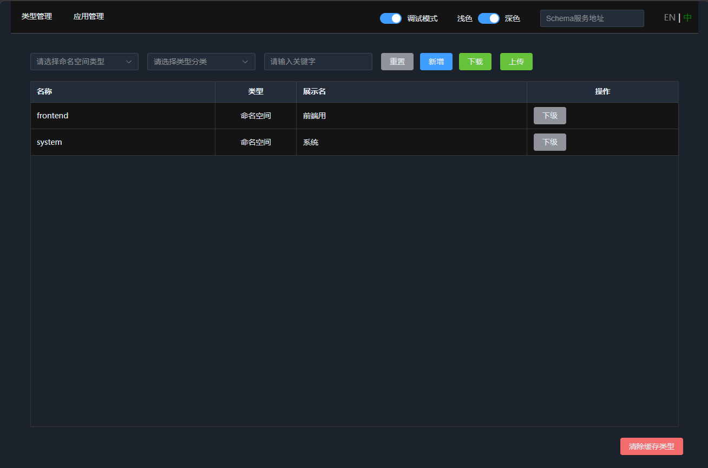
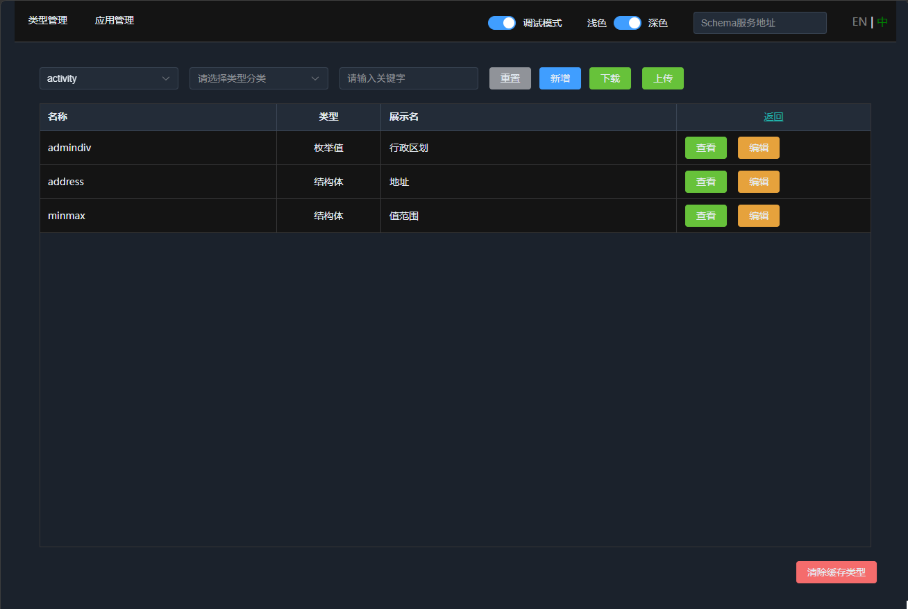
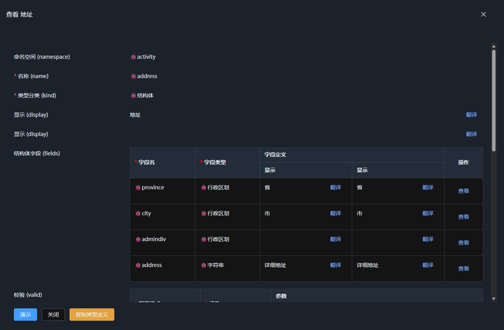
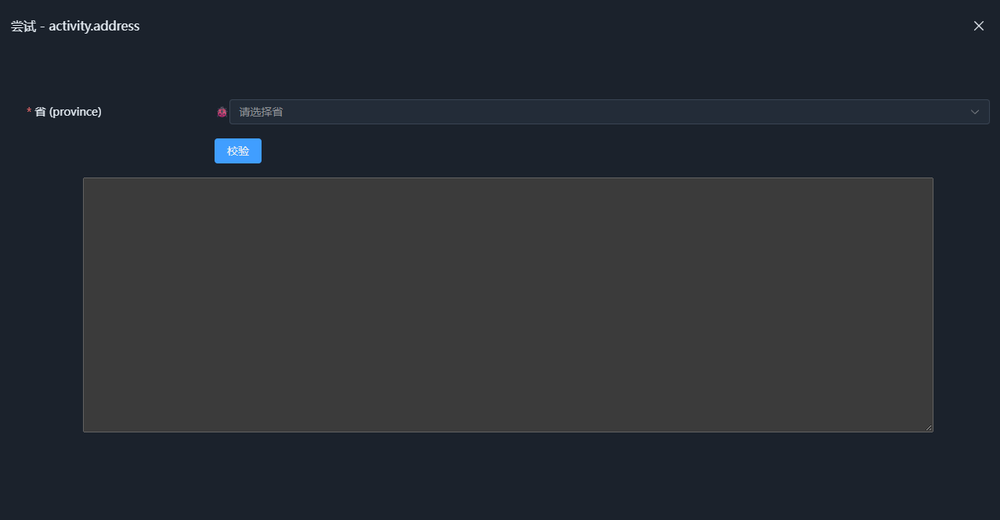
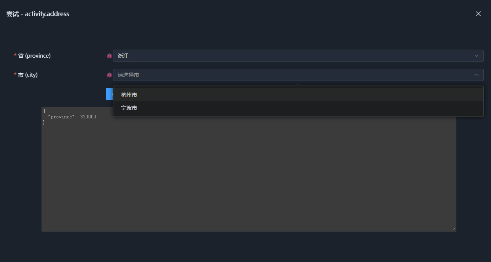
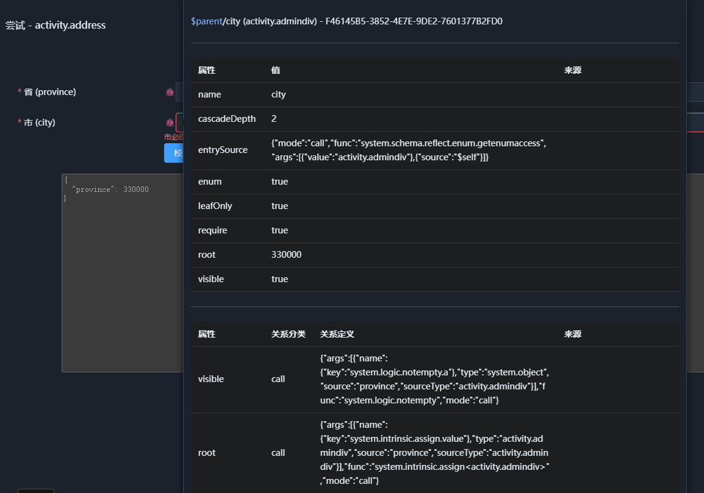
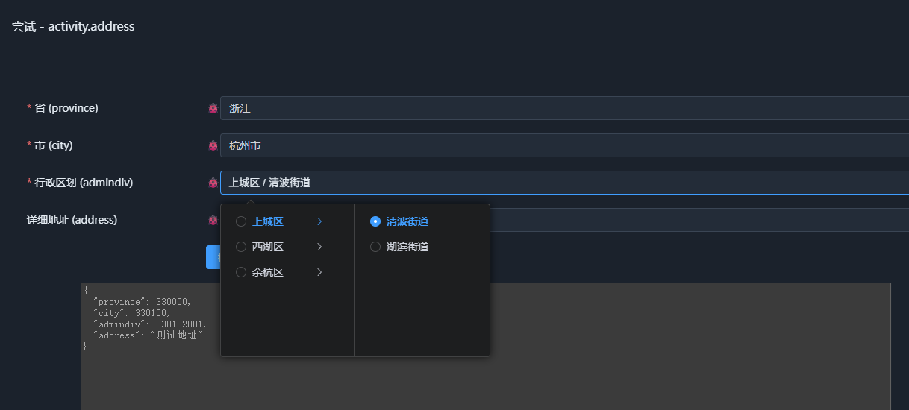
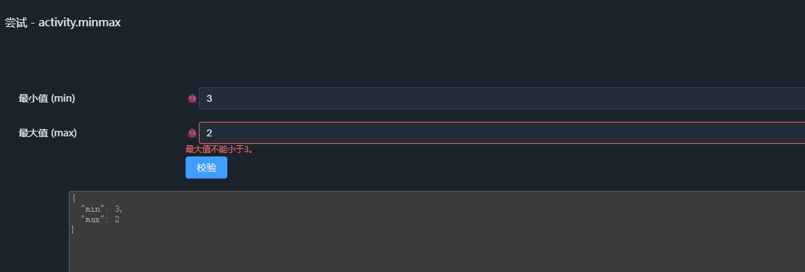
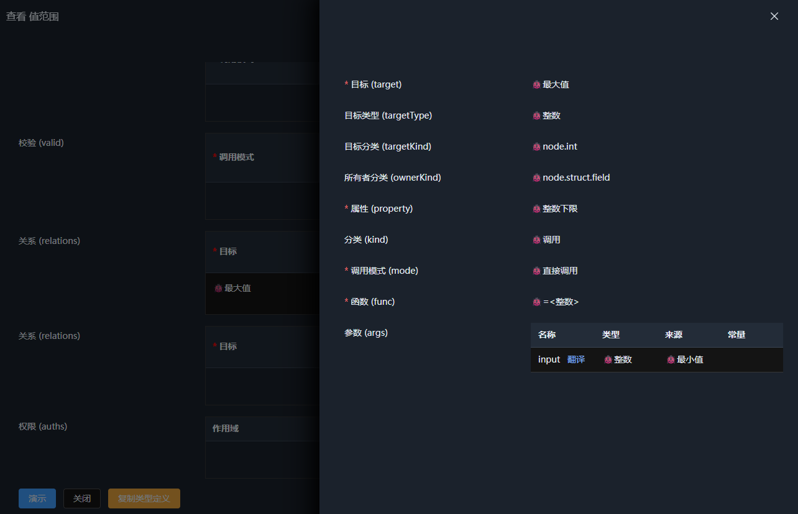
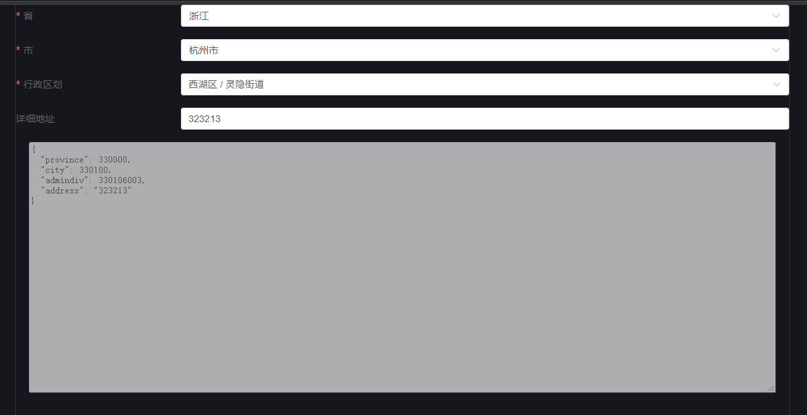

## 语义类型演示

本节演示语义类型的的基本使用。无需下载源码，直接在浏览器中运行即可。

1. 下载 [/schema/type.json](./schema/type.json) 文件，里面含有三个测试用类型。下载后可以自行查看，或者直接使用。

2. 打开 [https://kurapica.github.io/schema-node-man/#/type](https://kurapica.github.io/schema-node-man/#/type)，如图:

    

    建议开启 **调试模式**，以便查看语义节点的动态属性和关联。

3. 点击上传，选择刚才下载的 `type.json` 文件。可以看到命名空间多了一个 `activity`，点击进入可以看到三个语义类型:

    

    其中`address`地址类型依赖于`admindiv`行政区划类型，所以测试基于 `address`和`minmax`两个类型。

4. 点击 `address` 类型的查看按钮，可以看到它的前三个字段都使用了`admindiv`语义类型。如图:

    

    可以跳过细节，直接点击左下角的**演示**按钮，查看地址类型的示例数据。

    

    选择`省`后，可以看到`市`的选择：

    

    因为开启了 **调试模式**，输入框内左侧会显示一个🐞图标，鼠标移入后可以看到这个节点的所有属性和关联，其中`root`对应`省`选择值，这样我们限定了市的选择范围。而`cascadeDepth`则限制了级联的选择层级，确保我们只能选择市，而非更下层的行政区划。

    

    继续选择，最后完成整个地址的输入。

    


5. 同样可以查看`minmax`类型，它更加简单，它限制最大值的下限为最小值的录入值：

    

    关闭演示画面后，在下面的关系配置中，可以找到它:

    

    如果手动打开 `type.json`也可以找到这个关系的申明:

    ```json
    "relations": [
        {
        "call": {
            "args": [
            {
                "type": "system.int",
                "source": "min"
            }
            ],
            "func": "system.intrinsic.assign<system.int>",
            "mode": "call"
        },
        "kind": "call",
        "target": "max",
        "property": "lowlimit"
        }
    ]
    ```

以上介绍覆盖了枚举和结构体类型，以及关系的配置，可以自行修改，如果出现问题，在界面上选择`清除缓存类型`即可。


## 如何引入前端项目

如果不考虑后端，而想将语义类型引入前端项目，可以参考以下步骤：

# 基于 SchemaNode 创建前端项目

SchemaNode 前端项目由以下三个核心包组成：

- `schema-node-core`：SchemaNode 核心运行时
- `schema-node-app`：应用层能力
- `schema-node-vue-view`：Vue 3 UI 视图层

此外需要安装：

- Vue 3
- Element Plus

## 1. 创建 Vue 3 项目

使用 Vite 创建一个新的 Vue 3 + TypeScript 项目：

```bash
npm create vite@latest my-schema-app -- --template vue-ts
cd my-schema-app
npm install
```

也可以使用其他方式创建 Vue 3 项目，只要最终使用 Vue 3 + TypeScript 即可。

## 2. 安装 SchemaNode

安装 SchemaNode 核心包：

```bash
npm install schema-node-core schema-node-app schema-node-vue-view
```

安装 Vue 3 和 Element Plus：

```bash
npm install vue element-plus
```

如果创建项目时已经包含 Vue，则无需重复安装。

## 3. 配置入口文件

将之前下载的 `type.json` 文件放入项目`src/assets`目录下。

打开 `src/main.ts`，引入 Element Plus，并加载 `type.json`和SchemaNode核心包：

```ts
import { createApp } from 'vue'
import './style.css'
import App from './App.vue'
import ElementPlus from 'element-plus'
import 'element-plus/dist/index.css'
import schema from './assets/type.json' // 加载语义类型文件
import { initSchemaRuntime, saveNodeSchema, setLanguage } from 'schema-node-core'

setLanguage('zhCN') // 设置语言为中文
initSchemaRuntime() // 初始化SchemaNode运行时
saveNodeSchema(schema) // 注册Json文件中的语义类型

const app = createApp(App)

app.use(ElementPlus)

app.mount('#app')

```

## 4. 修改 `App.vue` 中的代码

修改为

```ts
<template>
  <el-form label-width="240px" :model="data!" label-position="left" >
    <schema-view
      text="left"
      type="activity.address"
      :in-form="SchemaNodeFormType.ExpandAll"
      v-model="data"
    ></schema-view>
    <section style="width: 100%;text-align: center;">
      <textarea style="width:72lh;height: 20rem;" disabled>{{ data }}</textarea>
    </section>
  </el-form>
</template>

<script lang="ts" setup>
import { _LS } from "schema-node-core"
import { ElForm } from "element-plus"
import { schemaView, _L, SchemaNodeFormType } from "schema-node-vue-view"
import { ref } from "vue";

const data = ref(null)

</script>
```

`schema-view`是 `schema-node-vue-view` 提供的通用组件，用于渲染 SchemaNode 语义数据节点，这里通过 `type="activity.address"` 来指定要渲染的语义类型。

保存后就可以使用 `npm run dev` 查看效果:



三个项目中只有`schema-node-core`是核心包，类似`schema-node-vue-view`是样例视图库，替换比较容易，不过如果只是需要作为内部或者配置UI用，是足够的。

更详细的定制化在后续章节中介绍。