# 02. App 应用演示

本演示约需 10 分钟，完整走一遍从应用配置到数据自动流转的过程。如果只想快速了解核心能力，可以直接跳到**应用演示**。

SchemaNode Core 是基于 C# 实现的纯类库，负责定义域、公共语义共识及其相关的语义运行时能力，但不直接提供完整的业务应用执行环境或对外服务接口。

本章演示的业务应用及其执行能力，由 SchemaNode App 方言提供。

SchemaNode App 并非 Core 的组成部分，而是基于实际业务实践构建的一套应用原型及其执行实现，面向常规业务开发。

它提供应用管理、租户隔离、数据模型与视图、CRUD、角色权限与数据权限、数据推送和基于语义函数的数据血缘追踪等能力。工作流部分暂未开放。

App 是建立在公共语义共识之上的一种方言实现，可作为参考，也可以根据实际需求直接改造。SchemaNode 项目关注的是公共语义核心的稳定性，而不是要求所有应用都采用同一套业务实现。

下面的例子将展示基于 App 完成的访问权限管理，行级数据权限与过滤，数据推送，基于语义函数解析数据血缘追踪，以及一些跨数据表的数据关联等。


## 环境准备

1. 下载本项目 `https://github.com/kurapica/schema-node-csharp`，解压后，打开`SchemaNode.sln`，然后打开`SchemaNode.Example`的`Program.cs`文件。

    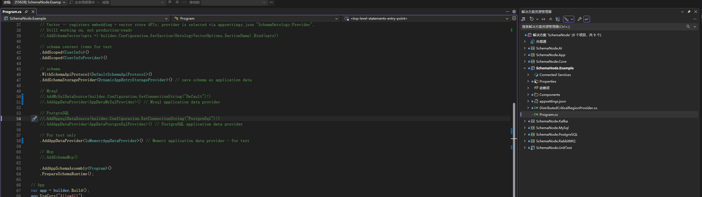

    这里重点是数据库配置，项目附带了 MySql，PostgreSQL以及一个仅用于测试的内存简化数据源。

    如果没有特殊需求，保持默认，采用测试用数据源即可，如果想看 App 自动生成和维护的数据库表结构，也可以注释掉 `.AddAppDataProvider<InMemoryAppDataProvider>()`，然后启用对应数据库的代码，并在 `appsettings.json` 中修改好连接字符串。

---

2. 启动`SchemaNode.Example`，目前不用关注其它启动细节。

    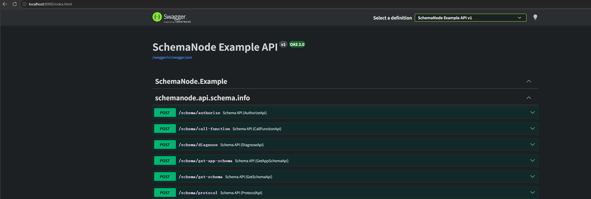

    启动后可以看到项目的`Swagger`，这些api接口均由 SchemaNode.App 项目提供。整个项目接口围绕原型设计，而非围绕语义类型。所以，API数量仅和语义原型数量有关。

    同样目前不用关注这些API。修改浏览器地址为`http://localhost:8000/schema-node-man#/app`，可以看到应用配置界面。

---

3. 这个UI是`schema-node-man`的编译后版本，可以替换 `SchemaNode.App/www.zip` 来替换它。和`类型管理`可以仅前端使用不同，`应用管理`仅当连接后端服务器时才可以使用。

    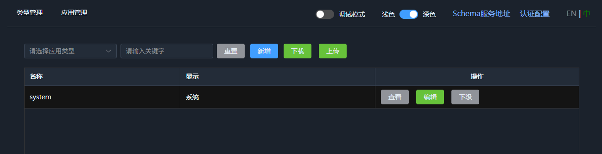

---

4. 下载下列几个app定义文件，按顺序上传:

    * [用户域-用户管理](./app/user.json)
    * [组织域-场馆管理](./app/org.json)
    * [活动域-活动管理](./app/activity.json)

    上传后，可以看到多了三个应用，准备工作就完成了。

    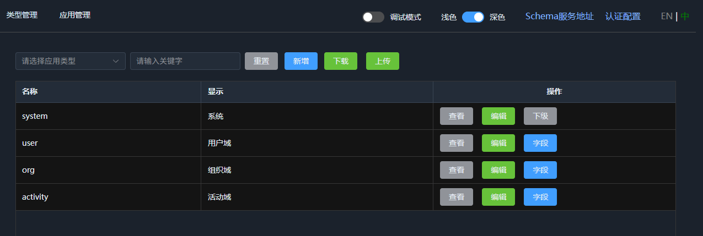

    虽然这是配置界面，不过通过应用字段的演示，我们也可以完成实际的CRUD操作。下面是基于语义配置，驱动几个应用执行的演示。

    > 这里上传的 JSON 文件，并不是手动编写的配置文件，而是通过配置界面操作后导出的完整应用定义。在实际使用中，你通常不需要接触这些 JSON 文件——所有的应用、字段、权限、关系都在配置界面上完成。JSON 只是用于在不同环境之间迁移应用，或者用于问题排查时单独发送。


## 用户准备和配置访问权限

1. 添加用户

    在上图中，点击用户域对应行的`字段`按钮，然后点击 `演示`，再点击`加载数据`。点击`添加`按钮，添加几个用户，将第一个用户配置为`是管理员`，并记录好这些用户的ID。然后保存即可。

    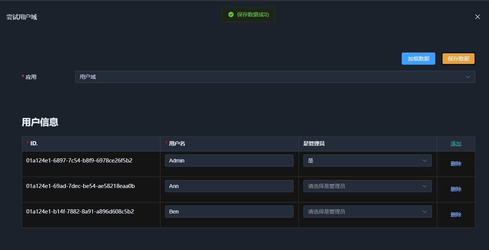

---

2. 配置用户请求头

    在Web服务中，请求经过网关后，通常会将用户，租户等信息随附到请求头中，这是重要的请求上下文。

    在回到应用管理页面后，点击`认证配置`，我们在这里配置请求头对上下文进行模拟:

    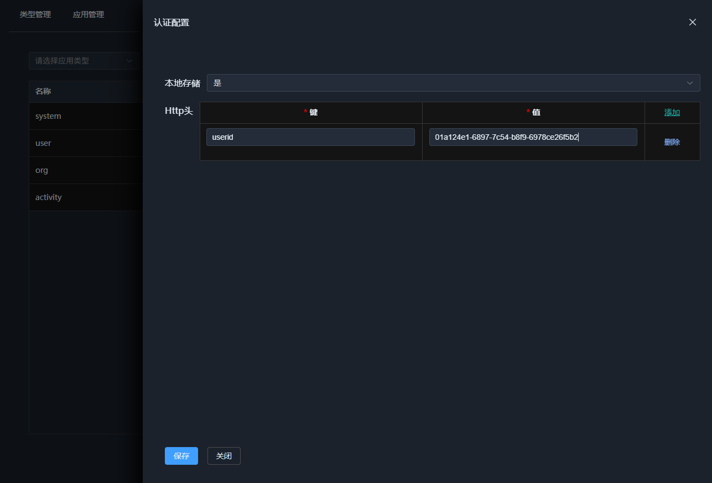

    注意，`本地存储`选择`是`, Http头则输入`userid`，然后值用管理员的Id。

---

3. 启用访问权限

    在前一章和上述上传类型和应用时，是没有权限限制，所有人都可以访问的。当我们有了用户后，我们就可以开始对整个系统进行细粒度的权限管理。

    3.1 配置语义类型访问权限
    ---

    切换到`类型管理`画面，找到`system`类型，然后编辑它，为它添加权限管理，`Auths`属性是 SchemaNode.App 为 `node`原型附加的属性，它可以配置无参数返回值为布尔值的函数作为自身的评估函数，这些函数内部会基于请求上下文获取当前访问人的userid, orgid之类，来完成校验。

    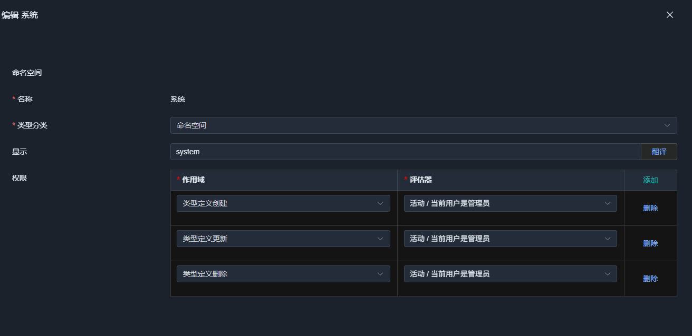

    > 注意不要配置`类型定义读取`，会影响后续测试

    这里评估器选择 `活动/当前用户是管理员`，如果没看到这个函数，刷新下浏览器，让它重新从服务器获取，这个函数是刚才上传的App中附带的，有兴趣可以自己查看，实现就是基于`userid`去用户域的表中查询，是否存在并且是管理员。

    配置后，可以尝试将`认证配置`中的id修改掉，刷新后可以看到编辑，新增都被禁用了，当然实际限制在后端完成。前端会根据权限评估结果调整界面操作，但这只是权限机制的可视化表现。实际的访问控制仍由后端执行，不能仅依赖前端禁用按钮来保障安全。

    这里用system命名空间配置，是因为权限检查采用的是继承，如果一个用户在父级类型具有权限，即具有所有子类型的对应权限。但system的上级命名空间无法访问，而system命名空间始终存在，所以，用它的权限配置当作最顶级命名空间的权限配置即可，这样，管理员对最顶层命名空间具有所有权限，自然可以访问和修改所有的语义类型。

    
    3.2 配置应用访问权限
    ---

    切换到`应用管理`后，同样可以配置`system`应用容器，不过，相比类型多了数据管理权限需要配置：

    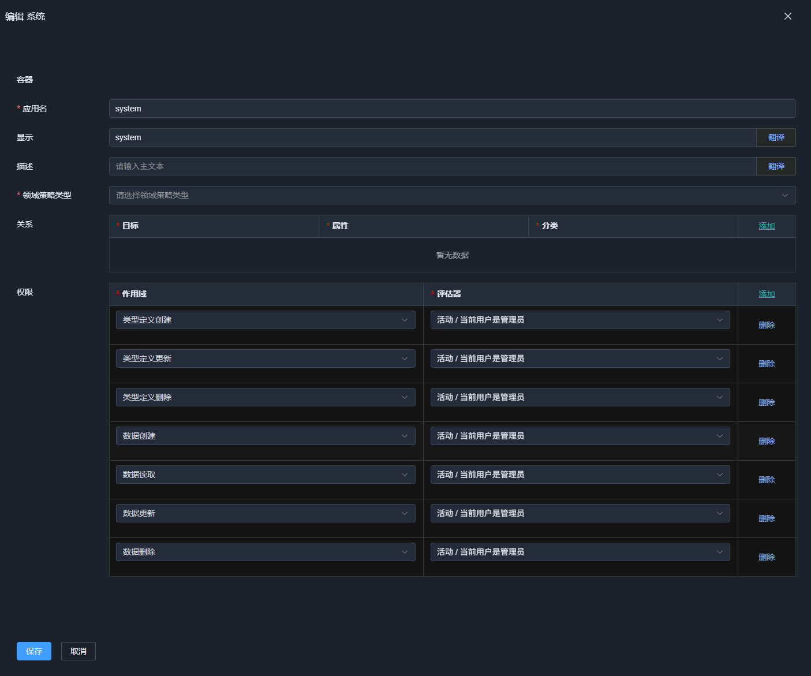

    > 注意，不要配置`类型定义读取`，会影响后续测试

    之后还可以在应用的字段上配置访问权限进行细节管理，应用字段继承所在应用的权限，而应用则继承所在应用容器的权限，以此类推。

---

## 应用演示

1. 添加活动场所，使用`组织域`-`字段`-`演示`，添加几个场所等会使用:

    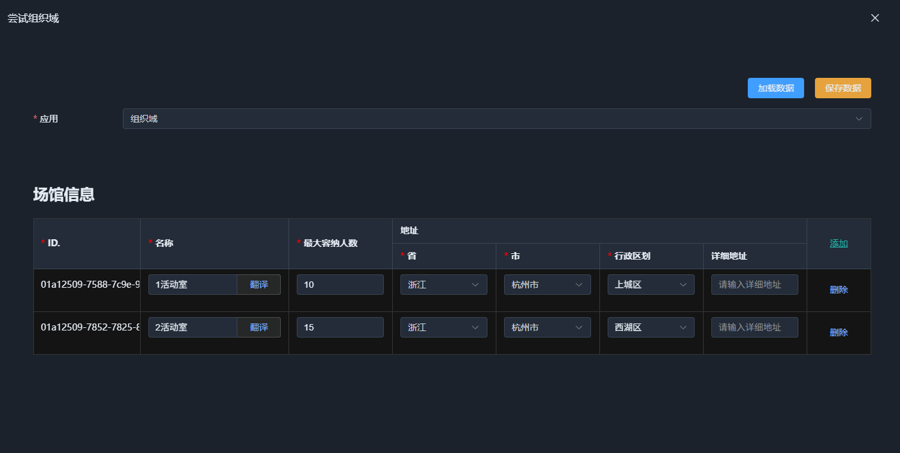

---

2. 打开`活动域`-`字段`-`演示`，和上述两个应用不同，`user`和`org`应用都是系统级应用，数据是全局使用的，而活动域采用`业务目标`配置，它需要一个`target`作为应用的目标，它可以是用户id，组织id，项目id等。

    > App 系统设计初，是为了融入微服务而非替换，所以，类似项目管理并非一定在SchemaNode App 项目中管理，SchemaNode 主要负责项目的业务实现和未来迭代。

    > 基于语义编程也非替代现有项目开发模式，它在面对复杂业务和需要长期迭代维护的场景更加适用。

    > 所以实践中，我们采用的是混合模式，强硬要求所有都走语义申明，在一些场合代价会超过收益。

    > 在 App 系统的详细介绍中，会看到进一步基于租户进行访问隔离的配置方式。

    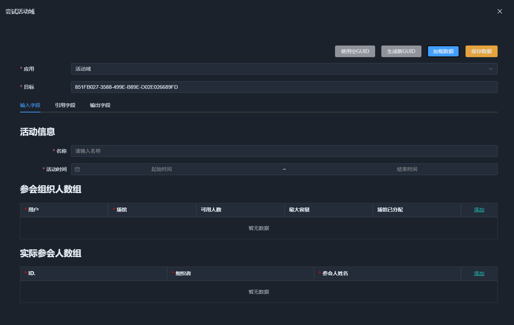

    使用`生成GUID`构造一个目标，然后`加载数据`即可，现在让我们补冲一些活动信息:

    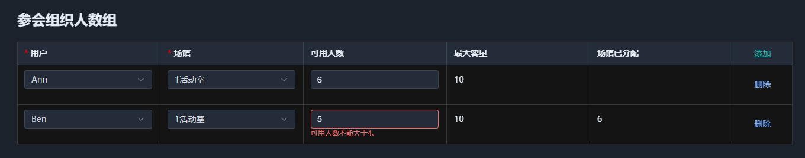

    其实这里可以注意到，用户和场馆都是基于之前录入的用户和场所进行选择，可以退回到活动的字段列表，可以发现:

    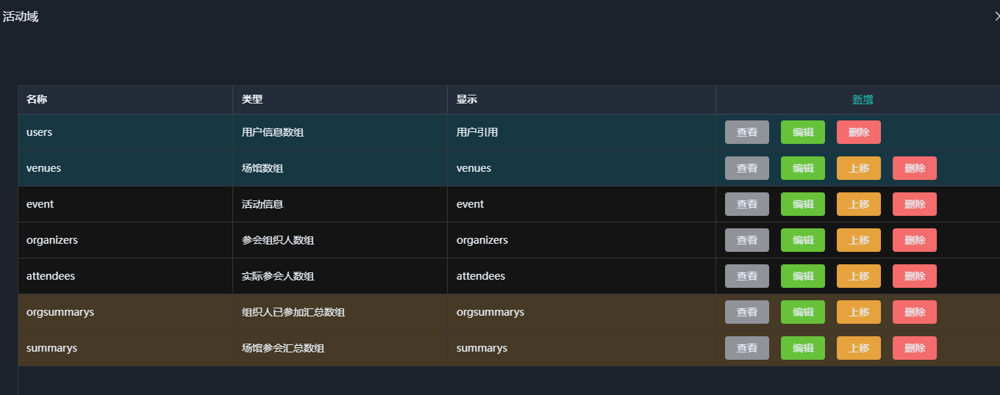

    最上面的`users`和`venues`是视图字段，因为源应用是系统级，所以引用比较简单，只要字段类型和目标应用的字段的类型一致就可以选择。

    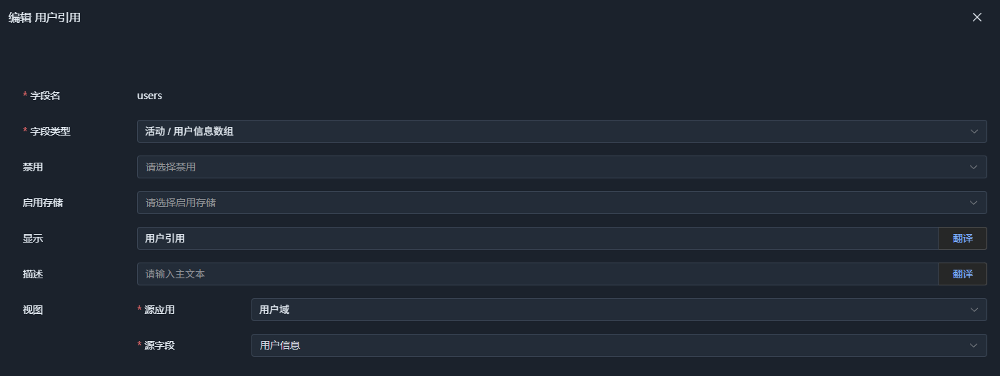

    回到演示画面，可以查看引用数据，可以看到录入的数据。

    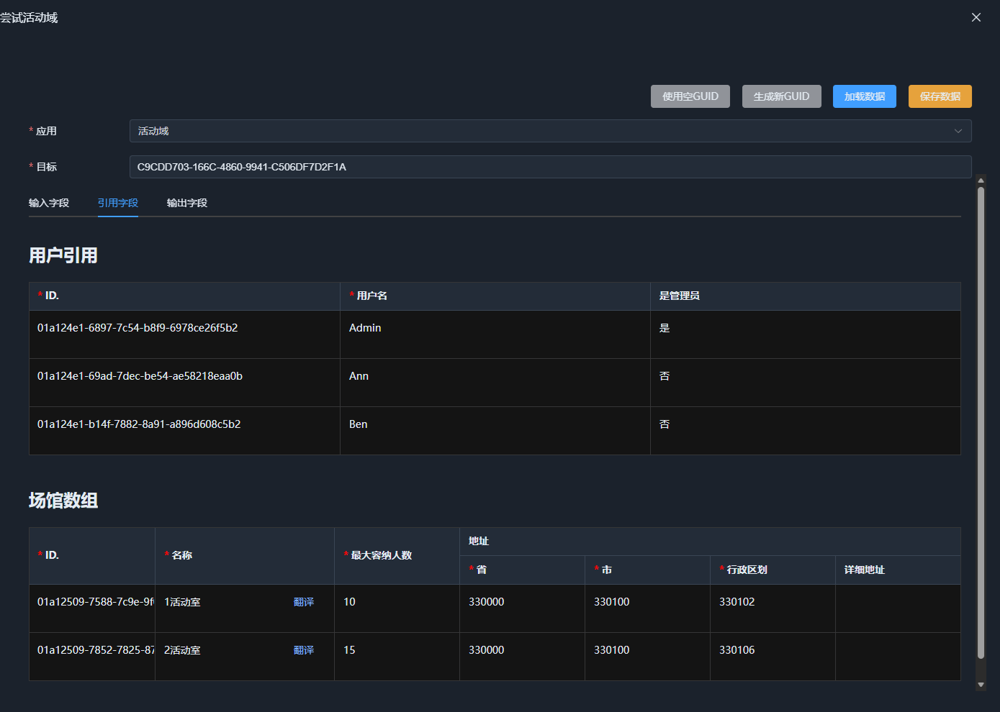

    确认这点后，可以回到`应用管理`界面，然后编辑 `activity(活动域)`，可以看到一些关联，类似:

    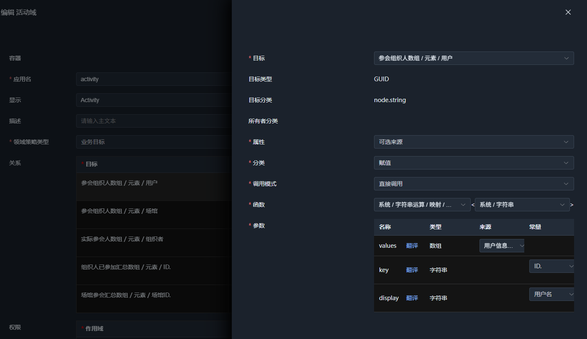

    App对应的节点是所有字段对应节点的上级节点，所以，它可以完成跨字段配置关联。不过注意，App的关联和语义类型内部的关联不同，页面上的数据可能是分页数据，是不完整的，所以它的用途一般有限，而且后端也几乎不会基于这类关联进行处理。

    这里我们使用`用户列表`和`场馆列表`为`参会人数组`的录入提供名单，这样我们不需要去输入ID。

    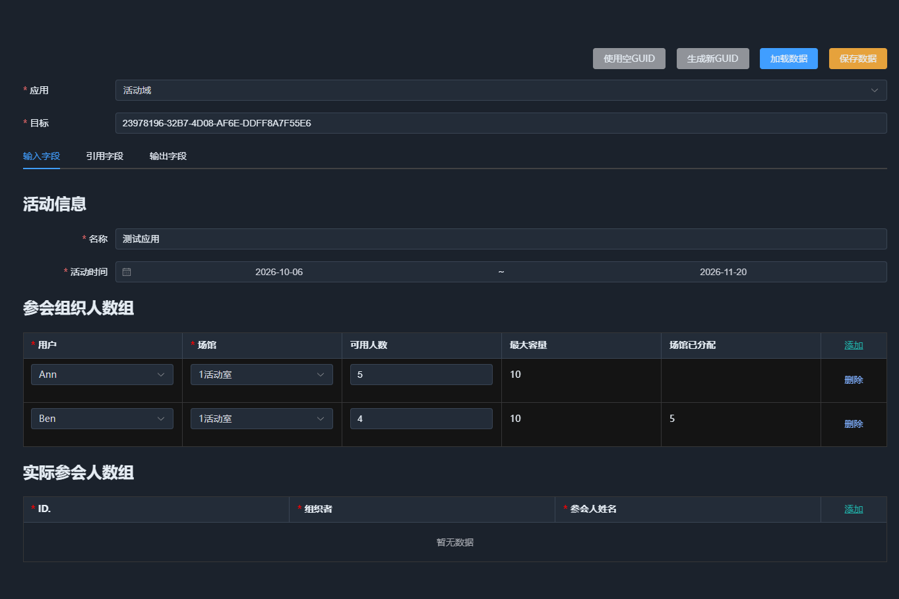

    最后类似这样录入两个数据，创建两个活动组织人即可。保存后，将`Ann`的用户ID输入到`认证配置`中，然后刷新界面，我们切换用户再来访问`活动域`。

---

3. 以组织人身份填报参会人数据，其中还有一列是组织人自身的ID，但当用户是组织人时设置为隐藏了。

    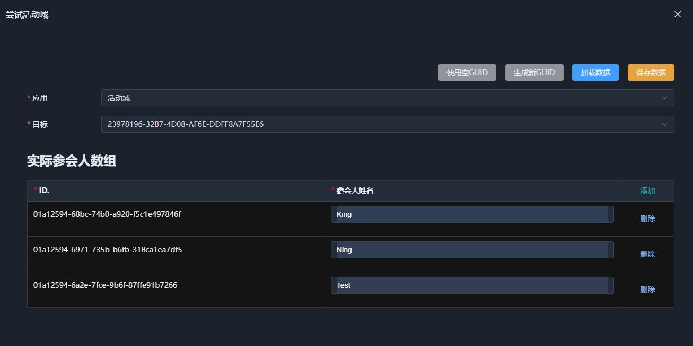

    如果不是使用内存数据源，而是MySql之类数据源的话，保存后，可以再次`加载数据`，然后查看SQL，会看到组织人自身的ID被用于查询。

    这个配置在参会人的行级数据权限与过滤中配置:

    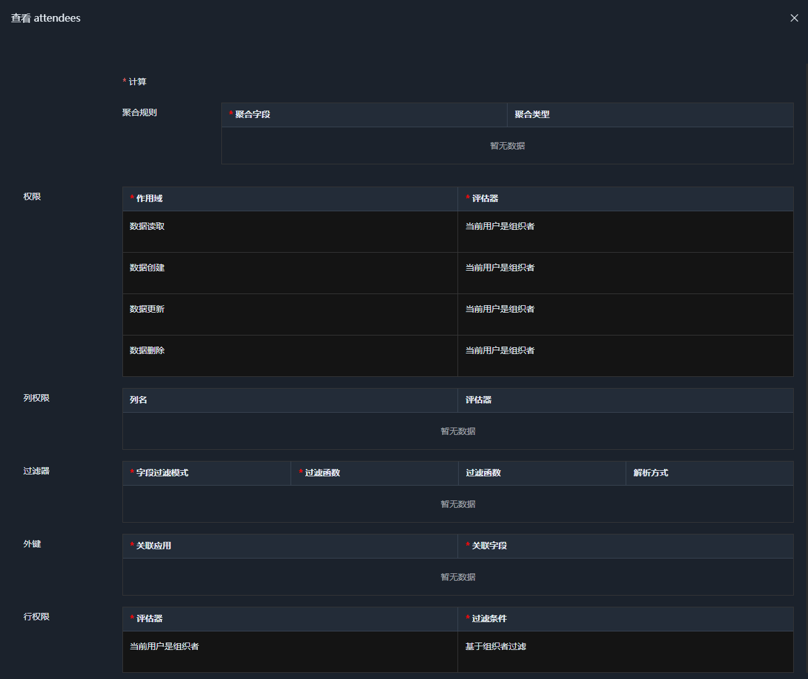

    基于组织者过滤是一个比较简单的函数，即当前用户id和数据的orgnizer一致:

    ```js
    (attendee) => attendee.orgnizer = system.data.getcontext('user.id')
    ```

    这个行过滤条件，在上传数据时作为校验，而查询时则作为过滤条件，并且和其它查询条件合并后，作为最终查询执行树给到数据层，完成查询。

---

4. 调整`认证配置`为管理员ID，然后重新打开项目，看到`输出字段`：

    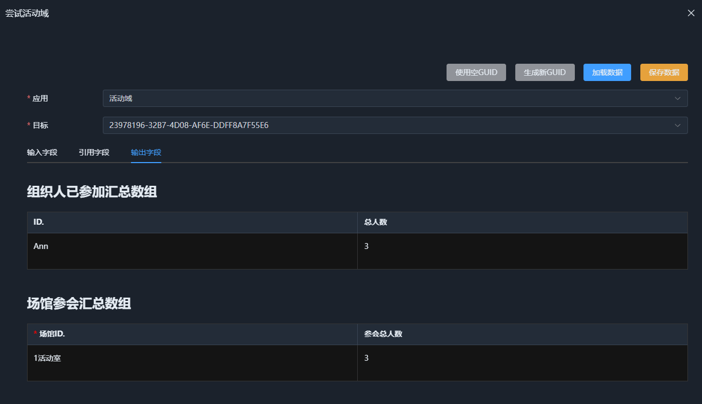

    `组织人已参加汇总`是基于`参会人`人的`orgnizer`作为主键计数得到的汇总记录。

    `场馆汇总`则是基于`orgnizer`所属的场馆id作为主键进行汇总，这里实际已经需要追踪血缘，因为是跨表完成的汇总。

---

5. **修改`Ann`所属场馆**，可以看到汇总数据的转移：

    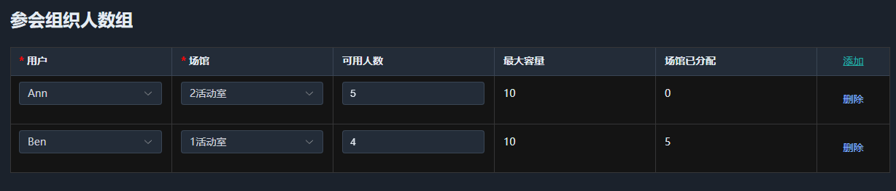

    然后保存，再重新加载数据:

    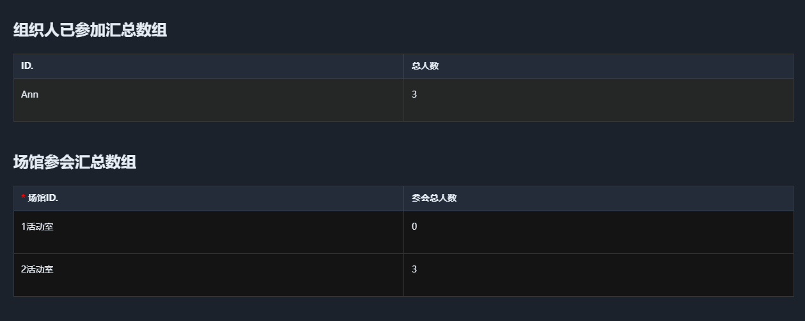

    Ann 作为组织人的参会人数汇总没有变化，但场馆参会汇总的数据转移了。

---

6. 现在返回字段列表，查看或者编辑`场馆参会汇总数组`，可以看到
    
    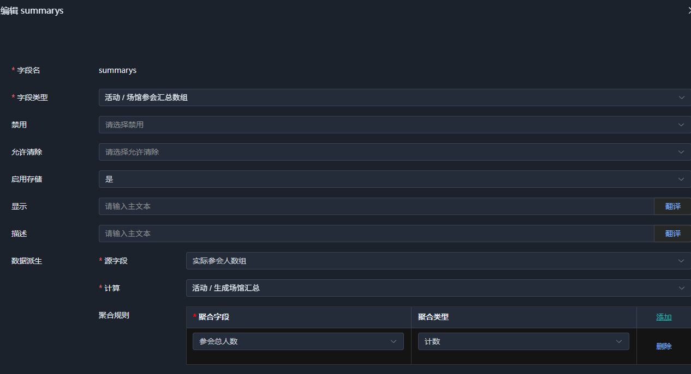

    它指定了数据源字段，和计算用函数，然后配置聚合规则为计数。除此外，并不需要进行其它特殊配置。

    可以进一步到类型管理中查看`活动/生成场馆汇总`的语义函数，它的定义中

    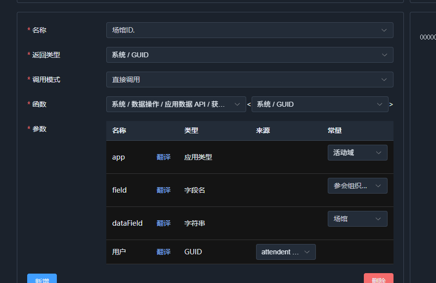

    场馆ID的获取是采用了特定的语义函数，从第三方字段中获取，它获取的键和查询的键在这个调用中都是明确的，基于语义函数解析得到记录会被注册。所以，当修改组织人的所属场馆时，系统基于注册的记录可以判定，场馆参会汇总需要被重新计算，并且涉及的场馆是这个组织人所属场馆的新旧值。


## 工作流(暂未开放)

SchemaNode App 实际是这套系统的第二个版本，在最新的三版重构中，SchemaNode Core是从它里面剥离的，然后再基于Core和App 方言设计重构了整个SchemaNode App, 不过时间有限，而且我并不希望早期因为工作流提供的可用性，影响了这个项目实际想实现的目的。所以，暂缓开放和演示它的工作流部分。


## 结语

通过前面的类型定义与 App 应用演示，我们从不同层面展示了 SchemaNode 的核心设计：以公共语义共识为基础，通过语义类型、正交属性、关系与函数构建可组合的语义结构，并由执行层将其投影为实际的执行能力。

类型管理展示了语义结构的定义与扩展，App 则进一步展示了这些语义如何应用于真实的业务场景，包括数据访问、权限控制、跨表关联、数据处理与依赖追踪。

需要强调的是，SchemaNode App 只是基于实践构建的一种方言实现，并非 SchemaNode 的全部，也不是对业务开发模式的限定。SchemaNode Core 关注的是公共语义的表达与组合能力，具体的业务模型、执行方式及其扩展，仍然可以根据实际需求进行设计。

目前，SchemaNode 已经具备了从语义定义到实际执行的基本实现，但这并不意味着它所探索的语义空间已经完整。公共语义共识可以继续演进，新的语义方言也可以在此基础上不断构建。对于 SchemaNode 而言，现有实现是一个起点，而不是一个预先限定了所有应用场景的终点。

**SchemaNode 希望探索的，不只是如何更高效地构建应用，而是如何让结构化语义成为连接需求、数据与执行的共同基础。**